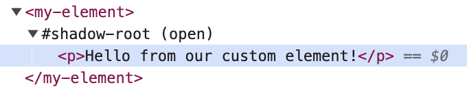

# Web Components and You (Part 1): The Shadow Dom

    Published , 
    

Web components are finally becoming truly usable, and [more](https://www.11ty.dev/docs/languages/webc/) and [more](https://enhance.dev/) and [more](https://bradfrost.com/blog/post/lets-talk-about-web-components/) are using them and touting them. So why should we use them? How do you get started?

In this post I hope to give a good answer to the "why" and introduce how to get started quickly with these glorious components.

## So, why should I care about web components?

If you've been in the Javascript scene for any amount of time you are probably tired of the framework wars. Web components are a collection of APIs that allow you to create and define HTML components (properly called "Custom Elements") in the same vein as making components in Javascript frameworks. The difference here is that these components are truly portable- they can be used anywhere you can use regular old HTML and they are treated like regular old HTML elements. This means that if you invest in web components there won't be a future where your computers just won't work anymore.

Web components also make use of a very important API to allow features like slots and modular css: the **shadow DOM**. This ominously named feature is really just a document fragment that has some special features. You can attach a shadow dom to your custom element, and anything rendered inside this shadow dom is encapsulated- meaning that it kind of treats that area like it's own little iframe renderer. Styles don't generally pass in and out of the shadow DOM, so you can be certain that outside css styles won't break your component styles. Also, IDs inside of a shado DOM won't conflict with IDs outside of a shadow DOM.

## Enough talk

Let's spin up the simplest visible custom element we can:

<play-ground>
  <template>
    <my-element></my-element>
    
  </template>
</play-ground>

First, you create a class that extends `HTMLElement`. Then, you use `customElements.define` to set what the custom element's tag name and class should be. This you can do once, and then whenever that tag is called, the browser uses your class to render the tag.

Next you'll see we are using the `connectedCallback` method. This is part of the [lifecycle APIs for custom elements](https://developer.mozilla.org/en-US/docs/Web/API/Web_components/Using_custom_elements#custom_element_lifecycle_callbacks). They roughly translate to the sort of callbacks you would see in Vue, React, and other frameworks. "connectedCallback" is roughly "onComponentMount". "attributeChangedCallback" is like a "onStateChange" callback. The one thing to note is that you don't normally use the constructor of a custom element. The constructor is actually run at the _time of registering_ with the `customElement.define` method.

If you inspect the element in the example, you will see a `#shadow-root (open)`

To demonstrate what we mean by style encapsulation, take a look at this next example. We're defining styles in the global document, but you'll notice those styles won't apply to what's inside the shadow DOM. This allows us to scope our styles and not worry about styles leaking in and breaking our components.

<play-ground>
  <template>
        
        
Paragraph outside of the custom element's shadow DOM

    <my-element></my-element>
    
  </template>
</play-ground>

So how do we add styles inside of our custom element? Well, there are many ways to skin that cat, but at the end of the day the styles need to be in the shadow DOM too, or the [shadow DOM needs to adopt a stylesheet](https://developer.mozilla.org/en-US/docs/Web/API/ShadowRoot/adoptedStyleSheets).

To keep things simple right now, let's just look at an example where the styles work inside the shadow DOM and don't affect the things outside of the shadow DOM.

<play-ground>
  <template>
    <my-element></my-element>
    
A paragraph outside of the shadow DOM

    
  </template>
</play-ground>

## So encapsulated styles are cool, but what else do we get with the shadow DOM?

One further thing we can do is leverage something called a **slot**. A slot is a dedicated spot in the template of the web component that you can fill in. For example, `textarea` has used this concept already. If you put text in between `<textarea>` and `</textarea>` you will see that text placed into the textarea input.

Here's a simple example:

<play-ground>
  <template>
    <my-element>
        
this is text being placed in a slot

    </my-element>
    
  </template>
</play-ground>

You can put the slot anywhere in your web component template and give it a `name` attribute. (If you don't give it a name, it will automatically be considered the "default" slot.) Then, you can put your content inside the custom element tags, and specify which slot that item should be put into. Here we used `slot="my-text"` to say "render this paragraph tag in the `my-text` slot".

This is powerful!

One interesting and mind-bending nuance to consider is that the content with a `slot` attribute is **reflected** into the slot position in the web components. And that means global styles will apply to the slot content. Think of it kind of like the content is rendered outside in the global document first, and then it's copied into the web component slot later.

<play-ground>
  <template>
    
    <my-element>
        
this is text being placed in a slot

    </my-element>
    
  </template>
</play-ground>

## What's with this innerHTML business?

Yes, we're using `this.shadowRoot.innerHTML` as a shortcut to add a template to the shadowRoot. In practice, you probably want to do this in a more maintainable way, such as creating elements and adding it to the shadowRoot, oldschool jQuery style 😎.

<play-ground>
  <template>
    <my-element></my-element>
    
  </template>
</play-ground>

But if you're unhappy with that, that makes complete sense! There are tools to help with more declarative templates. Check out [Lit](https://lit.dev/) as an example of a library that helps make templates easy with a `render()` method.

## Cool, but what about reactivity?

We've shown that web components allow for encapsulation and composition. But we haven't shown off one of their other features: attribute reactivity! We will cover that in the next post... stay tuned!

